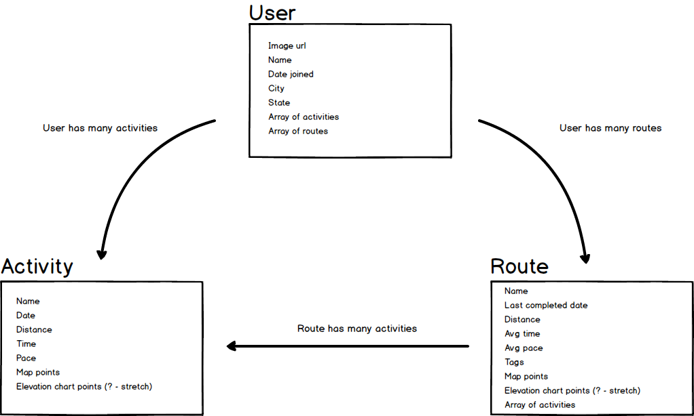
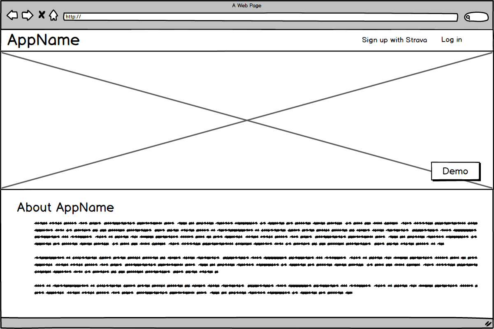
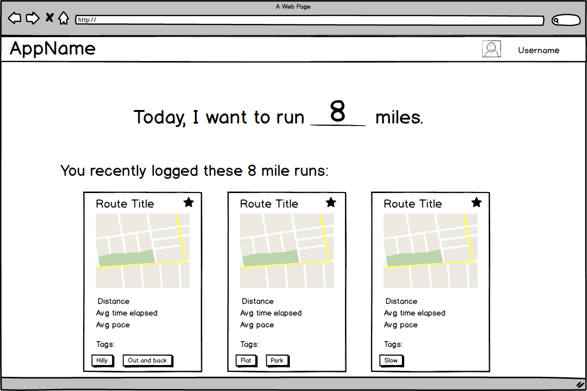
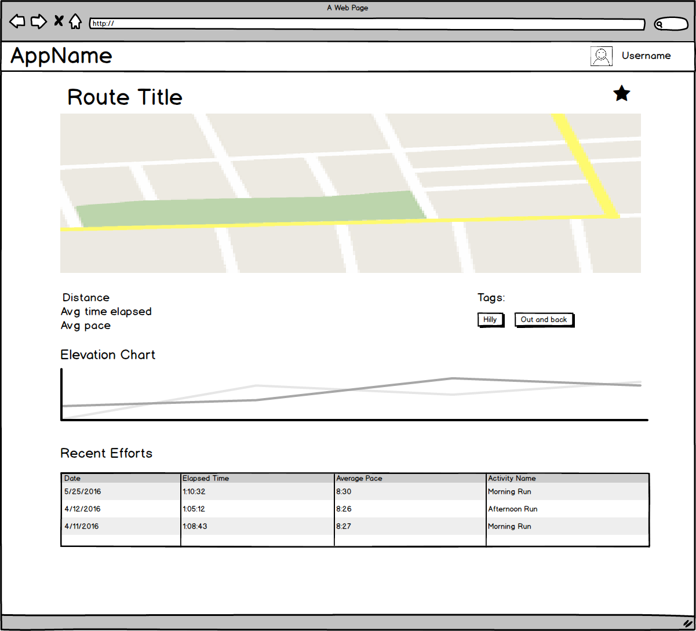
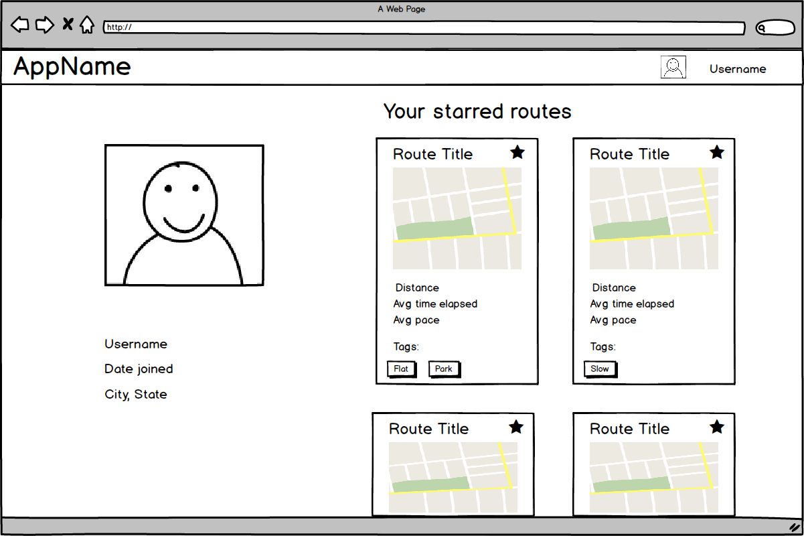

# [picka.run](http://www.picka.run)

https://pickarun.herokuapp.com/

### Description

picka.run is, simply put, a tool to help you pick a run. More specifically, it pulls your running activities from your Strava profile and matches them up with similar activities to create routes. picka.run calculates your average performance on each route, allows you to search your available routes by distance, and shows you a bunch of maps of options that you could use to hit your target distance for the day. It also allows you to explore routes run by other users in your area.

### Wireframes
ERD:

Landing Page:

Route Search:

Route Details:

User Profile:

### Technologies
+ PostgreSQL database
+ Ruby on Rails
+ Angular
+ Materialize
+ Google Maps
+ 3rd-Party Auth via Strava
+ Strava API

### Wish List
+ Filter run search by tag
+ Allow users to define their own tags
+ Different Splash image based on user location
+ Snap maps to polyline
+ More robust Explore feature
 + Explore by distance
 + Explore by tags
